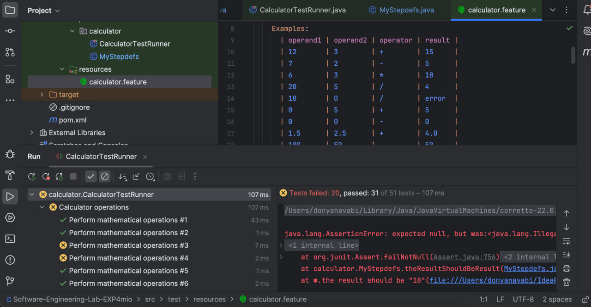

### گزارش آزمایش BDD: پیاده‌سازی ماشین حساب  

#### هدف آزمایش  

در این آزمایش، با استفاده از توسعه مبتنی بر رفتار (BDD)، یک ماشین‌حساب ساده پیاده‌سازی ‌کردیم. هدف اصلی این است که با نوشتن سناریوهای رفتارمحور در فایل‌های ویژگی (Feature) و استفاده از ابزار **Cucumber**، مطمئن شویم تمام نیازمندی‌ها به درستی پیاده‌سازی و تست شده‌اند.

#### توضیحات پروژه  

در ابتدا پروژه‌ی Maven می‌سازیم. این آزمایش پیاده‌سازی یک ماشین حساب با ۴ عملیات اصلی است. ساختار کد به صورت زیر است:

- `Calculator`: کلاس اصلی ماشین حساب که عملیات ریاضی (مانند جمع، تفریق، ضرب و تقسیم) را انجام می‌دهد.
- `Main`: با آن کاری نداریم.
- فایل‌های تست BDD: فایل‌های مشخصات و سناریوهای ماشین حساب در مسیر `src/test/resources` قرار دارند.  

در این آزمایش قابلیت‌های جمع، تفریق ضرب و تقسیم را پیاده‌سازی کردیم؛ همچنین حالتی برای جلوگیری از بروز خطا در صورت تقسیم بر صفر در نظر گرفتیم.

#### روند کار به روش BDD  

برای پیاده‌سازیِ هر یک از قابلیت‌ها، مراحل زیر دنبال شدند:

 
1. نوشتن ویژگی‌ها و سناریوها:
  
   

   فایل‌های ویژگی (Feature) با استفاده از Gherkin نوشته شدند و در مسیر `src/test/resources/calculator.feature` ذخیره شدند. هر ویژگی شامل سناریوهایی برای انجام عملیات جمع، تفریق، ضرب و تقسیم (و در نظر گرفتن عدم امکان تقسیم بر صفر) است.
   

2. پیاده‌سازی استپ‌ها (Step Definitions):
  
   

   استپ‌های مربوط به سناریوها در کلاس `MyStepdefs` که در مسیر `src/test/java/calculator` قرار دارد، پیاده‌سازی شده‌اند. این استپ‌ها شامل تعریف رفتارهایی مانند دریافت ورودی، فراخوانی متدهای کلاس `Calculator`، و بررسی خروجی‌ها است.
   

3. اجرای تست‌ها و رفع خطاها:
  
   

   ابتدا تست‌ها توسط ابزار `Cucumber` اجرا شدند. در شروع، تمام تست‌ها به دلیل عدم وجود پیاده‌سازی مربوطه خطا دادند (Fail شدند). سپس با اضافه کردن کد در کلاس `Calculator`، تست‌ها رفع خطا شده و پاس (Pass) شدند.
   

4. بازبینی و ریفکتورینگ:
  
   

   پس از تکمیل پیاده‌سازی، کدها بازبینی شده و عملیات ریفکتورینگ برای بهبود کیفیت و خوانایی در کلاس Calculator.java انجام شد و به جای if های پشت سر هم از switch case استفاده کردیم.
   

   #### گزارش پوشش تست‌ها  

میزان پوشش تست‌ها در مراحل مختلف پروژه به صورت زیر اسست:  

- قبل از پیاده‌سازی: 
  در ابتدا هیچ تستی پاس نشد:  
    

- پس از پیاده‌سازی کد در هر مرحله تست‌های بیشتری پاس می‌شد:  
    
    
    
     

- پس از تکمیل پیاده‌سازی: 
  با تکمیل پیاده‌سازی و اجرای موفق تست‌ها، تمام تست‌ها پوشش داده شدند.  
  
